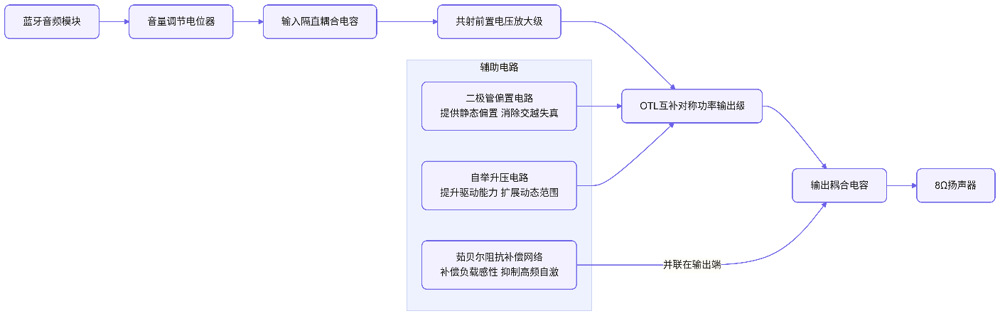
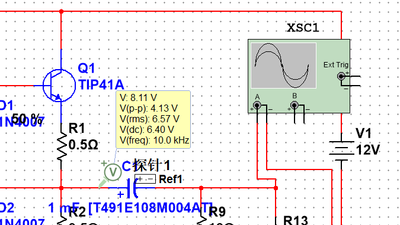
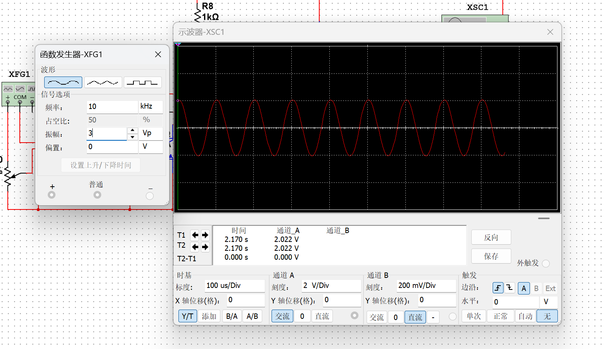
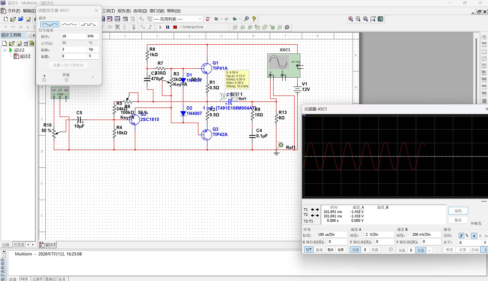
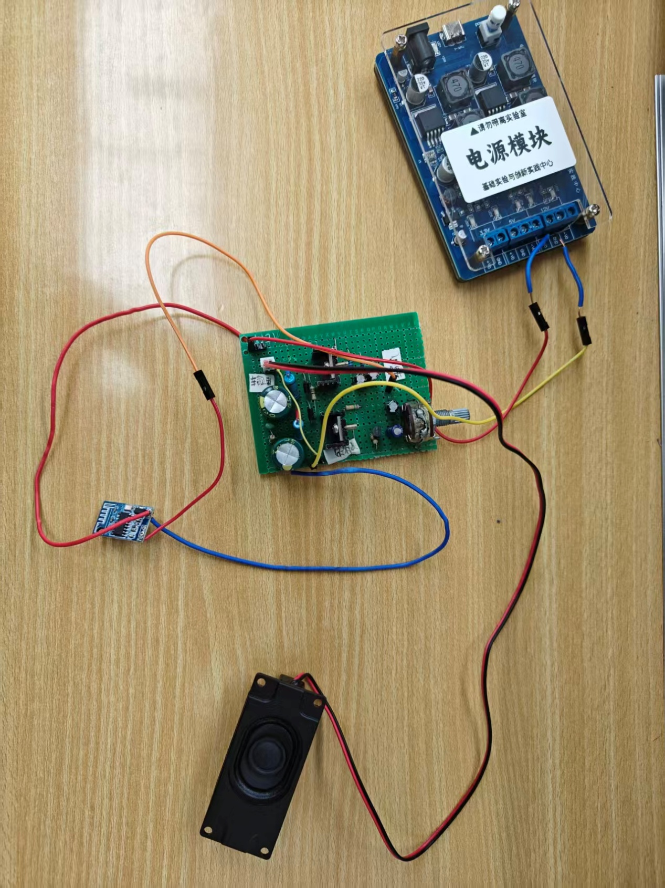
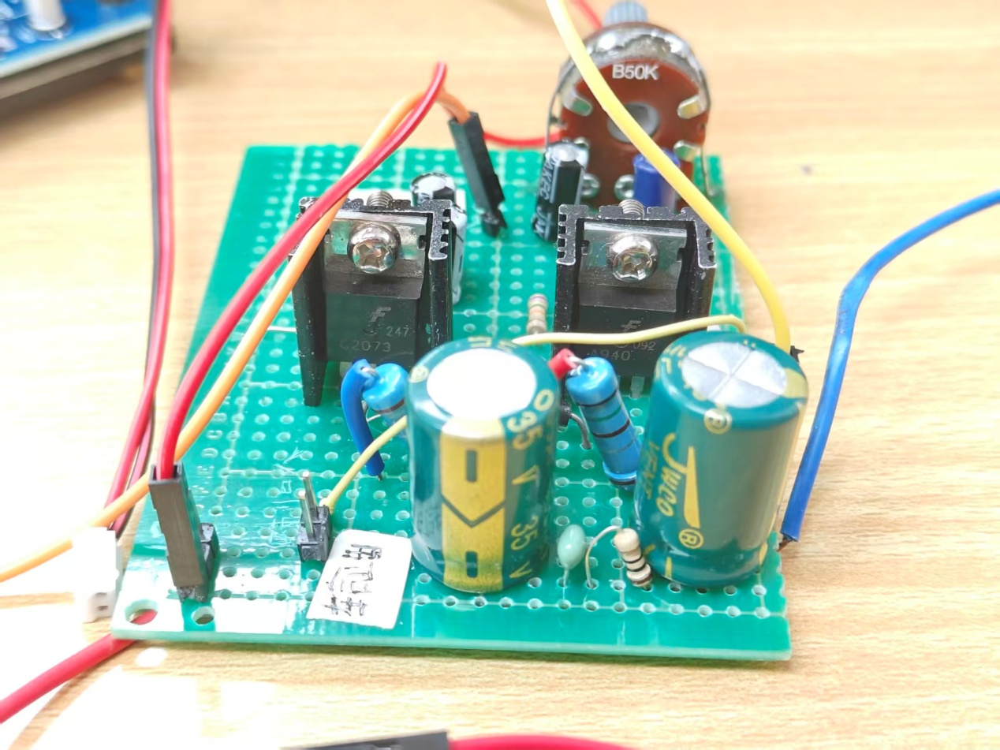
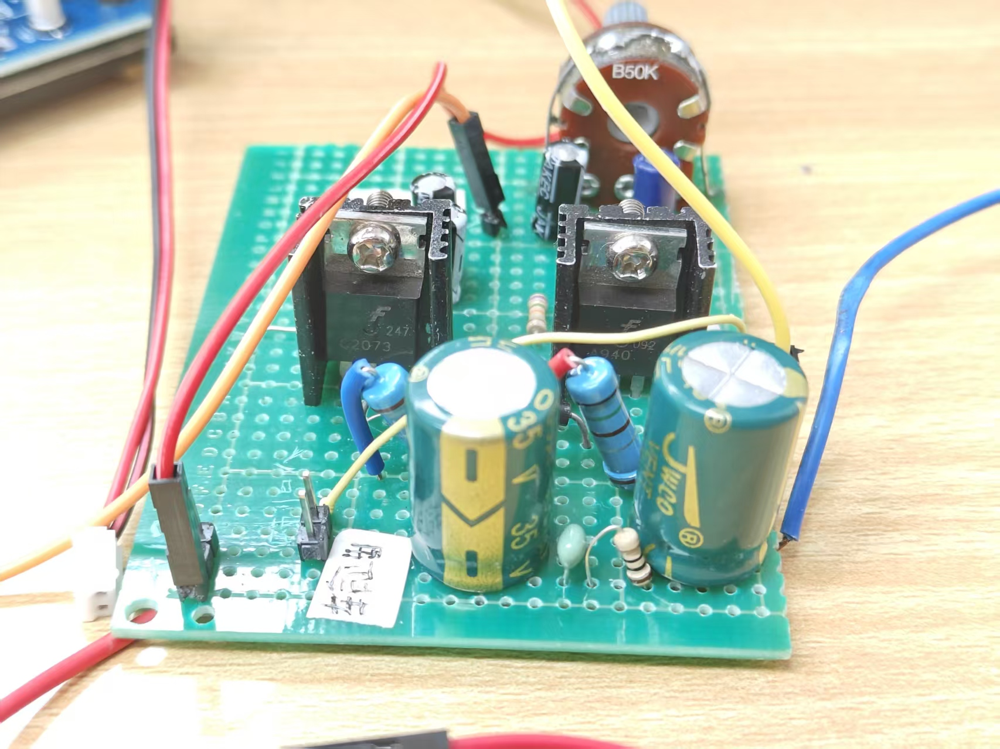

# 基于 OTL 互补对称功率放大电路的蓝牙音箱

> **课程设计报告** —— 模拟电子技术综合实践
>
> 本仓库分享一份基于分立半导体器件的 OTL 互补对称功率放大电路设计，
> 配合成品蓝牙音频接收模组，组成一台小功率蓝牙音箱。
>
> 报告聚焦电路原理分析、Multisim 仿真与实物调试过程，
> 适合作为模拟电子技术课程的参考资料。

---

## 一、设计任务与要求

### 1.1 设计任务

本设计以分立半导体器件为核心，设计并制作一款单电源供电的音频功率放大电路，
结合蓝牙音频模块与扬声器，搭建完整的蓝牙音箱系统，
实现无线音频信号的接收、放大与发声功能。

通过本设计掌握互补对称功率放大电路的工作原理、参数设计与调试方法，
理解音频功率放大系统的整体架构与工程实现。

### 1.2 性能指标要求

| 项目 | 要求 |
|------|------|
| 供电电源 | 直流 12V 单电源供电 |
| 负载阻抗 | 8Ω 扬声器 |
| 工作模式 | 功率管工作于甲乙类状态，消除交越失真 |
| 功能要求 | 具备音量调节功能，可通过蓝牙模块连接音频设备播放音乐 |
| 失真要求 | 额定输出下波形无明显交越失真与削波失真 |
| 稳定性 | 电路无高频自激，工作稳定可靠 |

### 1.3 核心目标与约束

- **核心目标**：基于分立元件实现高质量音频功率放大，完成蓝牙音箱的功能验证与性能调优
- **约束条件**：采用通用分立元器件，单电源供电，控制电路复杂度，兼顾原理学习与工程实用性

---

## 二、方案设计

### 2.1 可选方案对比

针对核心的音频功率放大环节，提出两种可行方案进行对比选型：

**方案一：集成功率放大芯片方案**

采用 LM386、TDA2030 等集成功放芯片搭建电路。
外围元件少，布线简单，调试难度低，性能参数一致性好。
但该方案无法深入理解功率放大电路的内部工作原理，不符合模拟电子技术实践的教学目标。

**方案二：分立元件 OTL 互补对称功放方案（采用）**

采用三极管、二极管、阻容元件等分立器件，
搭建甲乙类 OTL 功率放大电路，
包含前置电压放大级、功率输出级、偏置电路与自举电路。
该方案可完整展现功率放大电路的工作机理，
便于调试与参数优化，符合课程实践的学习目标，
同时可满足蓝牙音箱的功率需求。

### 2.2 方案选择

综合课程实践要求与原理学习目标，选择**方案二：分立元件 OTL 互补对称功率放大方案**。
该方案可系统训练模拟电路的设计、仿真、焊接与调试能力，
深入理解交越失真抑制、自举升压、阻抗补偿等核心知识点，
同时可实现满足日常使用的音频播放效果。

### 2.3 系统整体结构框图

系统整体分为四个功能模块，信号流向为：

> **蓝牙音频模块 → 音量调节与耦合电路 → 前置共射放大级 → 甲乙类互补功率输出级 → 扬声器**



### 2.4 电路整体工作流程

1. 蓝牙模块接收来自手机等设备的无线音频信号，转换为模拟音频电信号；
2. 信号经过电位器实现音量调节后，通过隔直耦合电容送入前置电压放大级，完成电压幅度的提升；
3. 放大后的信号进入互补对称功率输出级，由甲乙类工作的功率管对信号进行功率放大，最终通过输出耦合电容驱动扬声器发声；
4. 电路中设置偏置电路消除交越失真，自举电路提升输出动态范围，茹贝尔网络保证高频稳定性。

---

## 三、电路设计与仿真

### 3.1 电路设计（分模块进行设计）

本电路为带前置放大的甲乙类 OTL 功率放大电路，单电源 12V 供电，
可分为输入调节模块、前置电压放大级、偏置与自举电路、功率输出级、阻抗补偿网络五个部分。

#### 3.1.1 输入调节与耦合模块

由电位器 R10（100kΩ）与耦合电容 C5（10μF）组成。
R10 为可变电阻，通过改变输入信号的分压比例实现音量调节功能；
C5 为电解电容，起隔直耦合作用，
隔离前后级的直流电位，仅传递交流音频信号，
同时阻断直流分量对后级静态工作点的影响。

#### 3.1.2 前置电压放大级

由 NPN 型三极管 Q2（2SC1815）及周边阻容元件构成**分压式偏置共射放大电路**，
核心作用是对输入的弱音频信号进行电压放大，
为后级功率输出级提供足够的驱动电压幅度。

- **偏置电路**：R5（24kΩ）、R6（100kΩ 电位器）为上偏置电阻，
  R4（10kΩ）为下偏置电阻，
  通过电阻分压为 Q2 基极提供稳定的直流偏置电压，保证三极管工作在放大区。
  调节 R6 可改变基极偏置，从而调整前置级的静态工作点与放大倍数。
- **工作原理**：音频信号从基极输入，经三极管电流放大后，
  从集电极输出电压放大信号，以驱动后级功率管，
  该级为整个功放系统提供主要的电压增益。

#### 3.1.3 偏置与交越失真抑制电路

由二极管 D1、D2（1N4007）与可调电阻 R3（2kΩ）构成，
为互补功率管提供静态偏置电压。

- **原理**：两个二极管反向串联，利用二极管的正向导通压降（约 0.7V / 只），
  为 TIP41A 与 TIP42A 的发射结提供约 1.4V 的偏置电压，
  使两功率管在静态时处于微导通状态，工作在甲乙类，
  从而消除纯乙类工作时的交越失真。
- **可调性**：串联的电位器 R3 可微调偏置回路的总电压，改变功率管的静态电流；
  实际调试中可通过调节 R3，在消除交越失真与控制静态功耗之间取得平衡。

#### 3.1.4 自举升压电路

由 R8（1kΩ）、R7（330Ω）与自举电容 C3（470μF）组成，
用于提升功率管正半周的驱动能力，扩展输出电压动态范围。

**原理**：静态时，C3 通过 R7、R8 充电至稳定直流电压；
当输出信号正半周时，输出端电位升高，
由于电容两端电压不能突变，C3 正极电位随输出端同步抬升，
从而为 Q1 基极提供高于电源电压的驱动电位，
保证 NPN 功率管在正半周峰值时仍能充分导通，
避免输出波形正半周顶部被压缩，提高最大不失真输出幅度。

#### 3.1.5 互补对称功率输出级

由 NPN 型功率管 Q1（**2SC2073**）与 PNP 型功率管 Q3（**2SA940**）组成
**OTL（无输出变压器）互补对称功率放大电路**，
是整个系统的核心功率级，负责向负载提供足够的输出功率。

**工作原理**：单电源 12V 供电，静态时输出端直流电位约为电源电压的 1/2（6V 左右），
大容量输出耦合电容（1mF）充电至该电位。

- **信号正半周**：Q1 导通，Q3 截止，电源经 Q1、输出电容向负载供电，电容补充电荷；
- **信号负半周**：Q3 导通，Q1 截止，已充电的输出电容充当负半周电源，经 Q3 向负载放电。

两管交替工作，在负载上合成完整的正弦输出波形。

**发射极电阻**：R1、R2（0.5Ω）为功率管发射极小电阻，
引入电流负反馈，可稳定功率管的静态工作点，
同时限制输出短路时的峰值电流，对功率管起到一定的保护作用。

#### 3.1.6 茹贝尔（Zobel）阻抗补偿网络

由 R9（10Ω）与 C4（0.1μF）串联组成，并联在扬声器负载两端。

- **作用**：扬声器为感性负载，高频下阻抗升高，
  易导致放大器高频增益异常甚至自激。
  茹贝尔网络使总负载在宽频带内近似为纯阻性，
  补偿感性阻抗的影响，抑制高频自激振荡，
  改善电路的频率响应与工作稳定性。

#### 3.1.7 理论参数估算

**最大不失真输出功率（理想值）**

对于单电源 OTL 电路，最大输出电压峰值约为 Vcc/2，
因此最大不失真输出功率：

$$P_{om} \approx \frac{(V_{cc}/2)^2}{2R_L} = 2.25 \text{ W}$$

实际电路中受功率管饱和压降、发射极电阻压降影响，最大输出功率略低于该值。

**静态输出电压**

理想静态下输出端直流电压为电源电压的一半，
即 $V_{OQ} \approx 6$ V，仿真实测约 6.4V，与理论值基本吻合。

### 3.2 电路仿真

使用 Multisim 仿真软件对设计电路进行功能与参数验证，
仿真源文件位于 `multisim/` 目录。

#### 3.2.1 静态工作点仿真

断开输入信号，测量电路关键节点直流电位：

1. 功率输出端静态直流电压：约 6.4V，接近电源电压的 1/2，
   符合 OTL 电路的静态特性，输出电容可正常充电至工作电位。
2. 互补管基极电位差：约 1.4V，
   与两个二极管的正向压降之和一致，功率管处于微导通的甲乙类工作状态。
3. 前置级三极管各极电位正常，工作在放大区，静态工作点设置合理。



#### 3.2.2 动态波形仿真

输入 10kHz 正弦交流信号，调节输入幅度与偏置电位器，观察输出波形：

1. 小信号下输出波形完整对称，无明显交越失真，验证了甲乙类偏置的有效性；
2. 逐步增大输入信号，输出波形峰峰值可达到约 2V 以上，
   仅在接近满幅时出现削波失真，动态范围满足设计预期；
3. 调节音量电位器可连续改变输出幅度，音量调节功能正常。



#### 3.2.3 稳定性仿真

对电路进行交流频率扫描，
加入茹贝尔网络后高频段增益平稳，无自激尖峰，电路工作稳定；
移除网络后高频出现增益抬升，验证了阻抗补偿网络的作用。



### 3.3 元器件清单

| 序号 | 标识 | 元器件名称 | 型号/参数 | 数量 |
|:----:|:-----|:----------|:----------|:----:|
| 1 | Q1 | NPN 功率三极管 | 2SC2073 | 1 |
| 2 | Q3 | PNP 功率三极管 | 2SA940 | 1 |
| 3 | Q2 | NPN 小功率三极管 | 2SC1815 | 1 |
| 4 | D1、D2 | 整流二极管 | 1N4007 | 2 |
| 5 | R1、R2 | 碳膜电阻 | 0.5Ω | 2 |
| 6 | R4 | 碳膜电阻 | 10kΩ | 1 |
| 7 | R5 | 碳膜电阻 | 24kΩ | 1 |
| 8 | R7 | 碳膜电阻 | 330Ω | 1 |
| 9 | R8 | 碳膜电阻 | 1kΩ | 1 |
| 10 | R9 | 碳膜电阻 | 10Ω | 1 |
| 11 | R3 | 可调电位器 | 2kΩ | 1 |
| 12 | R6 | 可调电位器 | 100kΩ | 1 |
| 13 | R10 | 可调电位器 | 100kΩ | 1 |
| 14 | C3 | 电解电容 | 470μF / 25V | 1 |
| 15 | C5 | 电解电容 | 10μF / 25V | 1 |
| 16 | 输出电容 | 电解电容 | 1000μF / 25V（1mF） | 1 |
| 17 | C4 | 瓷片电容 | 0.1μF | 1 |
| 18 | — | 蓝牙音频模块 | CA6912 | 1 |
| 19 | — | 扬声器 | 8Ω / 3W | 1 |

---

## 四、电路的调试与测试

### 4.1 电路制作

电路采用洞洞板焊接制作，制作流程如下：

1. **规划布局**：按照信号流向从左至右排布元件，
   功率管靠近电源与输出端，前置级与输入回路远离功率级，
   减少级间干扰与电源耦合噪声。
2. **元件焊接**：遵循"先低后高、先小后大"的原则，
   先焊接电阻、电容、二极管等小型元件，
   再焊接三极管、电位器等立式元件，
   最后焊接电源接线、蓝牙模块接口与扬声器接线。
3. **检查导通**：焊接完成后用万用表通断档检查线路连接，
   排除虚焊、短路与错焊问题；
   确认电源正负极无短路后再进行通电测试。
4. **散热处理**：功率管加装小型散热片，
   避免长时间大音量工作时管子过热损坏。

实物展示图：





### 4.2 电路测试

#### 4.2.1 静态测试

不通入输入信号，接通 12V 直流电源，进行静态参数测试：

1. **输出端直流电压测试**：测量输出耦合电容正极电位，实测约 6.3V，
   与仿真结果接近，符合 OTL 电路半电源电压的设计要求。
2. **静态电流检查**：测量电源总静态电流，
   调节 R3 使静态电流控制在合理范围，
   避免无信号时功耗过大、管子发热严重。
3. **故障排查**：若输出端电压偏离 6V 过大，
   检查前置级偏置电阻焊接是否正确、功率管引脚是否接反。

#### 4.2.2 动态功能测试

1. **正弦信号测试**：信号发生器输入 10kHz 正弦波，
   示波器观察输出波形。
   初始状态存在轻微交越失真，缓慢调大 R3 阻值、增加偏置电压后，
   交越失真消失，波形光滑对称。
   逐步增大输入信号，测试最大不失真输出幅度，
   实测最大不失真输出功率约 2.25W，满足小功率音箱的使用需求。
2. **蓝牙音频实测**：连接蓝牙模块与手机，播放音乐测试实际听音效果。
   调节音量电位器可平滑控制音量，
   中小音量下音质清晰，无明显失真；
   大音量下低频表现饱满，无明显自激啸叫。
3. **稳定性测试**：连续通电工作 30 分钟，
   功率管温升正常，电路无自激、无异常噪声，工作状态稳定。

#### 4.2.3 测试过程中遇到的主要问题及解决方法

1. **交越失真**：初始焊接后小音量下声音发闷、波形有交越失真。
   解决方法：缓慢调节偏置电位器 R3，适当增大功率管静态电流，
   直至交越失真消失，同时兼顾静态功耗。
2. **高频轻微自激**：初始布线时输出线与输入线靠近，出现高频啸叫。
   解决方法：调整布线，将输入线与输出线分开走线，
   确认茹贝尔网络焊接正确后，自激现象消除。
3. **输出幅度不足**：正半周波形顶部压缩。
   解决方法：检查自举电容 C3 的极性与焊接，
   确认电容正极接自举回路、负极接输出端，
   修正后输出动态范围明显提升。

#### 4.2.4 测试结果与目标要求的对比

| 指标项 | 设计目标 | 实测结果 | 达标情况 |
|:------|:---------|:---------|:--------:|
| 供电电压 | 12V 直流 | 12V 直流 | ✅ |
| 负载阻抗 | 8Ω | 8Ω | ✅ |
| 交越失真 | 无明显交越失真 | 甲乙类偏置下已消除 | ✅ |
| 最大不失真功率 | ≥2W | 约 2.25W | ✅ |
| 音量调节 | 连续可调 | 调节平滑 | ✅ |
| 蓝牙播放功能 | 正常播放 | 连接稳定、音质正常 | ✅ |
| 工作稳定性 | 无自激、工作稳定 | 连续工作正常 | ✅ |

整体测试结果符合设计要求，各项功能与性能指标均达到预期目标。

---

## 五、心得体会

### 5.1 设计总结

本次设计完成了基于分立元件 OTL 功率放大电路的蓝牙音箱制作，
从方案选型、理论计算、Multisim 仿真到实物焊接调试，
最终实现了蓝牙无线音频播放功能，
输出音质清晰，音量调节平滑，电路工作稳定，
各项性能指标基本达到设计要求。

### 5.2 设计亮点与不足

**亮点：**

1. **原理完整**：采用全分立元件搭建功放电路，
   涵盖了共射放大、互补对称功率放大、自举升压、交越失真抑制、阻抗补偿等多个核心知识点，
   系统巩固了模拟电子技术基础理论。
2. **调试灵活**：电路中设置多处可调电位器，
   可分别调节前置级工作点、功率级偏置电流、输出音量，
   便于分步调试与参数优化，适合实践学习。
3. **功能完整**：结合蓝牙模块实现了无线音频播放，
   将理论电路与实际应用结合，具备实用价值。

**不足：**

1. **输出功率有限**：受 12V 单电源限制，最大输出功率约 2.25W，
   仅适合桌面小场景使用，若需更大功率可采用双电源 OCL 电路或更高供电电压。
2. **底噪抑制有待优化**：万能板布线存在一定分布参数，
   电源未增加额外滤波电路，大音量下存在轻微电源底噪，
   后续可增加电源 LC 滤波网络优化。
3. **保护电路缺失**：未设计输出短路保护、过流保护电路，
   误操作可能损坏功率管，实际产品中需补充完善。

### 5.3 优化建议

1. **实验内容方面**：可增加集成功放与分立功放的对比实验，
   更直观地体现两种方案的优劣与适用场景。
2. **仪器设备方面**：可配备失真度测试仪，
   便于定量测试电路的总谐波失真，提升测试的专业性。
3. **流程安排方面**：建议增加 PCB 设计环节，
   掌握从原理图到 PCB 的完整设计流程，提升工程实践能力。

---

## 参考文献

[1] 童诗白，华光英. 模拟电子技术基础（第五版）. 北京：高等教育出版社, 2015.

[2] 聂典. Multisim 14 电子系统仿真与设计. 北京：电子工业出版社, 2019.

[3] 安森美半导体. TIP41A/TIP42A 功率三极管数据手册. 2018.

[4] 谢嘉奎. 电子线路 非线性部分（第四版）. 北京：高等教育出版社, 2000.

---

## 仓库结构

```
OTL-Bluetooth-Speaker/
├── README.md                    # 本文档
├── LICENSE                      # MIT 协议
├── docs/                        # 课程设计报告 (Markdown)
├── multisim/                    # Multisim 仿真源文件
│   └── OTL-Bluetooth-Speaker.ms14
└── assets/
    ├── diagrams/                # 原理图、仿真截图
    │   ├── 01-block-diagram.png
    │   ├── 02-static-workpoint-simulation.png
    │   ├── 03-dynamic-waveform-simulation.png
    │   └── 04-ac-stability-simulation.png
    └── photos/                  # 实物照片
        ├── 01-finished-product-front.jpeg
        ├── 02-finished-product-side.jpeg
        └── 03-breadboard-detail.jpg
```

## 复现说明

1. **Multisim 仿真**：使用 Multisim 14+ 打开 `multisim/OTL-Bluetooth-Speaker.ms14`
2. **实物搭建**：按 `docs/` 中的元器件清单采购并按报告描述焊接即可
3. **蓝牙模块**：本设计使用成品 CA6912 蓝牙音频接收模组，
   市面上任何同规格 5V/12V、单端 LINE OUT 输出的蓝牙模组均可直接替换

## 许可证

本仓库代码、文档、仿真文件采用 **MIT 许可证** 开源。
详见 [LICENSE](LICENSE)。

电路实物照片版权属于原作者；如需商业使用请先联系原作者取得同意。
